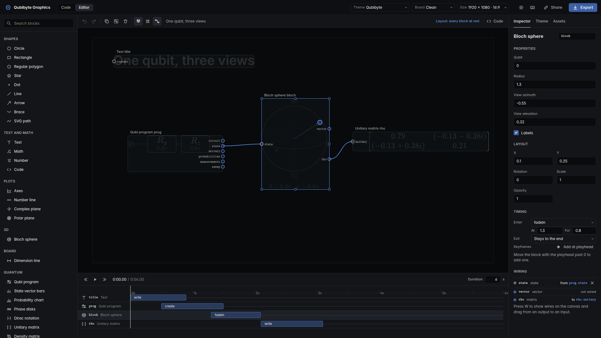

# Qubibyte Graphics

A visual editor for quantum computing. Write a circuit in Qubi, wire it to Bloch spheres, amplitude bars, phase disks, density matrices, and sweep plots, then animate the result on a timeline and export it as video, stills, or an interactive page.

**Live site:** https://trentrosenthal.github.io/QubibyteGraphics/ (the editor). Documentation and API reference: https://trentrosenthal.github.io/QubibyteGraphics/docs/site/



## What it does

- **Editor first.** Drag blocks from the library onto the canvas. A quantum view dropped next to the only Qubi program on screen wires itself to it; with several programs, drag a wire yourself (press W). Every block has an inspector, keyframes, and a row on the timeline.
- **Quantum from Qubi.** A Qubi block simulates its program and exposes the circuit, the state, the unitary, the probabilities, samples, and parameter sweeps. Dragging the Bloch sphere's handle writes the rotation back into the program.
- **Narrated explainers.** `explainQubi('Grover(0b110)')` builds the circuit, simulates it, and animates the state column by column, with Grover geometry and QFT phase wheels.
- **Simulators.** Statevector, density matrix, stabilizer, and noisy simulation; OpenQASM, Qiskit, and Cirq import and export.
- **Boards and themes.** 19 themes, and any theme can sit on a chalkboard, whiteboard, ruled paper, or blueprint while keeping its colors.
- **Export.** MP4, WebM with alpha, GIF, APNG, and PNG from the browser; the `qgfx` CLI adds HEVC, AV1, ProRes, PDF, animated SVG, Lottie, and SRT captions.

## Quick start

Open `index.html` (or the live site). The editor opens by default; the Code tab is there when you want to script a scene in JavaScript.

From the command line:

```sh
npm install
npx qgfx render examples/20-grover-explainer.js -o grover.mp4
npx qgfx still examples/22-bell-state.js -o bell.png --board chalkboard
```

A scene in code is a module that exports an async function:

```js
import { explainQubi } from 'qubibyte-graphics';

export const config = { theme: 'qubibyte' };

export default explainQubi('H 0\nCX [0,1]');
```

Rendering needs Node 20 or newer and `ffmpeg` on the path for video formats. Everything else, including fonts, KaTeX, and the ffmpeg.wasm used by the browser exporter, is vendored.

## Embedding

The `<qubibyte-scene>` element plays a scene in any page:

```html
<script type="module" src="https://trentrosenthal.github.io/QubibyteGraphics/qubibyte-scene.js"></script>
<qubibyte-scene src="my-scene.js" controls></qubibyte-scene>
```

## Documentation

- [Qubi reference](docs/qubi-reference.md) and [standard library](docs/qubi-stdlib.md)
- [Cookbook](docs/cookbook/01-qubi-explainers.md): short recipes, starting with quantum explainers
- [Decisions](docs/DECISIONS.md) and [progress](docs/PROGRESS.md)

## Development

```sh
npm test          # unit, parser, export, and golden tests
npm run test:e2e  # browser tests in Chromium
npm run lint      # ESLint plus the project's style and vocabulary checks
npm run build     # optional bundles in dist/
npm run build:docs
```

## License

MIT. Vendored fonts and libraries keep their own licenses; see each folder under `vendor/`.
